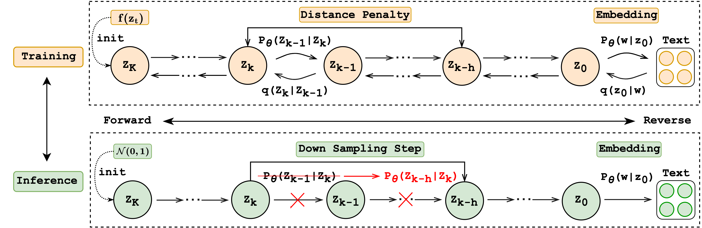

# Bridging the Gap between Training and Inference for Diffusion Model

This is the official code for [<font size=3>Can Diffusion Model Achieve Better Performance in Text Generation? Bridging the Gap between Training and Inference!</font>]()

# Model Architecture
<p align="center"></p>

# Dataset & Model Prepartion

## Dataset
We provide the download link for all the data used in our paper:

| Task | Dataset | Samples | Used in our paper | 
|------|---------| ---------| ---------|
|Text Simplification| [WIKI AUTO](https://github.com/chaojiang06/wiki-auto) | 677k | [download](https://drive.google.com/drive/folders/1BlWtD1UbnL_ef06Riq-gABlL0Zb50s-d?usp=sharing)|
| Paraphrase | [Quora Question Pairs](https://www.kaggle.com/c/quora-question-pairs) | 114k | [download](https://drive.google.com/drive/folders/122YK0IElSnGZbPMigXrduTVL1geB4wEW)|
| Story Generation | [ROC Story]() | 88k | [download]() | 
| Question Generation | [Quasar-T]() | 117k | [download]() | 
| E2E (Semantic / Syntax) | [E2E]() | 88k | [download]() | 

Please download the data and place under the ``./datasets`` folder

## Backbone Model

# Post-train Roc

```bash
cd scripts
export CUDA_VISIBLE_DEVICES=0,1,2,3
python -m torch.distributed.launch --nproc_per_node=4 \
--master_port=12238 --use_env run_train.py --diff_steps 2000 \
--microbatch 100 --lr 0.0001 --learning_steps 320000 --save_interval 2500 \
--seed 109 --noise_schedule sqrt --hidden_dim 128 --bsz 100 \
--dataset roc --data_dir datasets/ROCstory --vocab bert --seq_len 128 \github
--simi_penalty l2_noise_random --simi_lambda -1 --simi_step 10 --simi_noise 0.05 \
--resume_checkpoint ../ori_ckps/roc/ema_0.9999_240000.pt \
--schedule_sampler lossaware --notes roc
```


# Inference Roc

```bash
python sample_seq2seq.py \
--model_path ./post_train_diffusion_models/roc/ema_0.9999_270000.pt \
--step 2000 --batch_size 32 --seed2 10 \
--split test --out_dir generation_outputs  --decode_respacing "adp_20"
```

# Acknowledgement
We appreciate the open source of the following projects:

[DiffuSeq](https://github.com/Shark-NLP/DiffuSeq)&#8194;
[Diffusion-LM](https://github.com/XiangLi1999/Diffusion-LM)&#8194;
