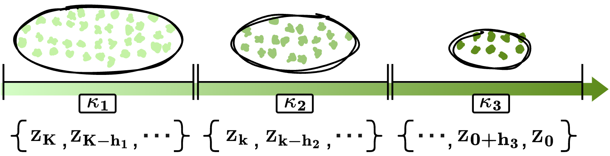

# Bridging the Gap between Training and Inference for Diffusion Model

This is the official code for [<font size=3>Can Diffusion Model Achieve Better Performance in Text Generation? Bridging the Gap between Training and Inference!</font>](https://arxiv.org/pdf/2305.04465.pdf) 

# Highlight

1. One can post-train your own diffusion model with two methods below to ``accelerate the inference`` speed and ``achieve better performance`` ! 

2. Extensive experiments show our method can generate a full sequence with 128 tokens in only ``4`` denoising steps !

## Model Architecture
<p align="center"></p>

## Down-Sampling Strategy 

<p align="center"></p>

# Dataset & Model Prepartion

## Dataset
We provide the download link for all the data used in our paper:

| Task | Dataset | Samples | Used in our paper | 
|------|---------| ---------| ---------|
|Text Simplification| [WIKI AUTO](https://github.com/chaojiang06/wiki-auto) | 677k | [download](https://drive.google.com/drive/folders/1yIo3qploLvtSc9CAzohAeKlHjOoNRfLg?usp=sharing)|
| Paraphrase | [Quora Question Pairs](https://www.kaggle.com/c/quora-question-pairs) | 114k | [download](https://drive.google.com/drive/folders/1kclZh3KTS1IOD3tre6ybsX7UhRkwEPeW?usp=share_link)|
| Story Generation | [ROC Story](https://cs.rochester.edu/nlp/rocstories/) | 88k | [download](https://drive.google.com/drive/folders/1bvjIroxJaACGIkACwSxCCJHPh1PBR3Zv?usp=sharing) | 
| Question Generation | [Quasar-T](https://drive.google.com/drive/folders/122YK0IElSnGZbPMigXrduTVL1geB4wEW?usp=sharing) | 117k | [download](https://drive.google.com/drive/folders/122YK0IElSnGZbPMigXrduTVL1geB4wEW?usp=sharing) | 
| E2E (Semantic / Syntax) | [E2E](http://www.macs.hw.ac.uk/) | 88k | [download](https://drive.google.com/drive/folders/1YJwa3SIqg2d0VkfzCrVEo8QtrZwkxcBX?usp=sharing) | 

Please download the data and place under the ``./datasets`` folder

## Backbone Model
Please refer to the following repos for more details:

[DiffuSeq: Sequence to Sequence Text Generation with Diffusion Models](https://github.com/Shark-NLP/DiffuSeq)

[Diffusion-LM Improves Controllable Text Generation](https://github.com/XiangLi1999/Diffusion-LM)

``Note`` We also provide the one post-trained model [link](https://drive.google.com/drive/folders/1UvcN9mKOv-nVZuQpJaAOQWCG22sGk_2O?usp=sharing) for quick check


# Quick Start
We provide the code for post-training on QQP (Paraphrase) dataset

## Environment
```
conda create -n diffsuion python=3.9
conda activate diffusion
pip install -r requirement.txt
```

## Training
We conduct experiment with 4 NVIDIA-A100(40GB)
```bash
cd scripts
export CUDA_VISIBLE_DEVICES=0,1,2,3;

DISTRIBUTE_ARGS="
    --nproc_per_node=4 \
    --use_env
"

TRAIN_ARGS="
    --diff_steps 2000 \
    --microbatch 100 \
    --lr 0.0001 \
    --learning_steps 320000 \
    --save_interval 2500 \
    --seed 109 \
    --noise_schedule sqrt \
    --hidden_dim 128 \
    --bsz 100 \
    --dataset qqp \
    --data_dir datasets/QQP \
    --vocab bert \
    --seq_len 128 \
    --simi_penalty l2_noise_random \
    --simi_lambda -2 \
    --simi_step 10 \
    --simi_noise 0.05 \
    --resume_checkpoint /path/to/checkpoint \
    --schedule_sampler lossaware \
    --notes qqp
"

python -m torch.distributed.launch $DISTRIBUTE_ARGS run_train.py $TRAIN_ARGS

```


# Inference

```bash
python sample_seq2seq.py \
    --model_path /path/to/checkpoint \
    --step 2000 \
    --batch_size 16 \
    --seed2 10 \
    --split test \
    --out_dir generation_outputs  \
    --decode_respacing "adp_20"
```


# Acknowledgement
We appreciate the open source of the following projects:

[DiffuSeq](https://github.com/Shark-NLP/DiffuSeq)&#8194;
[Diffusion-LM](https://github.com/XiangLi1999/Diffusion-LM)&#8194;
